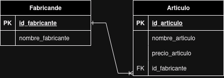
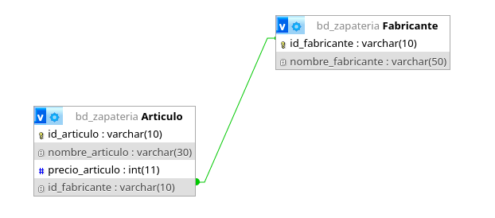
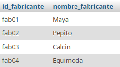
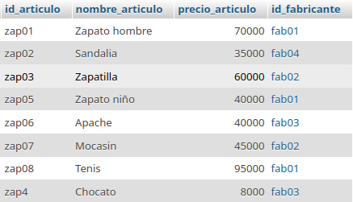
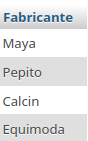
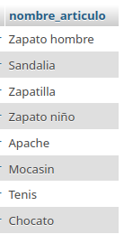
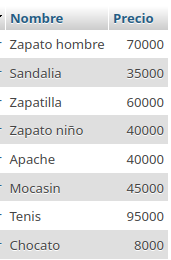

# Sistema para una zapateria

## Modelo Entidad-Relacion

## Modelo fisico de la BD

## Tabla fabricante

## Tabla Articulo

## Consultas a la BD

1. Mostrar la lista de todos los datos de los fabricantes

`SELECT * FROM Fabricante;`

2. Mostrar la lista de nombres de los Fabricantes, ponendo un alias al nombre de la columna

`SELECT nombre_fabricante AS Fabricante FROM Fabricante;`

3. Mostrar los nombres de los productos

4. Obtener los nombres y los precios de los productos de la tienda.

`SELECT nombre_articulo AS Nombre, precio_articulo AS Precio FROM Articulo;`

