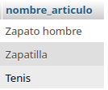
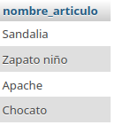
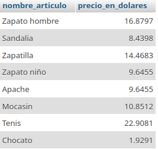
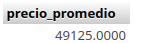

# Sistema para una zapateria

## Modelo Entidad-Relacion

## Modelo fisico de la BD

## Tabla fabricante

## Tabla Articulo

## Consultas a la BD

1. Mostrar la lista de todos los datos de los fabricantes

`SELECT * FROM Fabricante;`

2. Mostrar la lista de nombres de los Fabricantes, ponendo un alias al nombre de la columna

`SELECT nombre_fabricante AS Fabricante FROM Fabricante;`

3. Mostrar los nombres de los productos

4. Obtener los nombres y los precios de los productos de la tienda.

`SELECT nombre_articulo AS Nombre, precio_articulo AS Precio FROM Articulo;`

5. Obtener los nombres de los articulos cuyo precio sea superior a 50000

`SELECT nombre_articulo FROM Articulo WHERE precio_articulo > 50000;`

6. Obtener el nombre de los articulos cuyo preco este entre 5000 y 40000 (ambos incluidos)

### Forma 1
`SELECT nombre_articulo FROM Articulo WHERE precio_articulo >= 5000 AND precio_articulo <= 40000;`

### Forma 2

`SELECT nombre_articulo FROM Articulo WHERE precio_articulo BETWEEN >= 5000 AND 40000;`

7. Obtener el nombre y el precio en dolares de todos los articulos

`SELECT nombre_articulo, precio_articulo / 4147 AS precio_en_dolares FROM Articulo; `

8. Calcular el precio promedio de todos los articulos

`SELECT AVG(precio_articulo) AS precio_promedio FROM Articulo; SELECT AVG(precio_articulo) AS precio_promedio FROM Articulo;`

9. obtener el precio promedio de los articulos cuyo id del fabricante sea fab02

10. Obtener el numero de articulos cuyo precio sea mayor igual a 50000